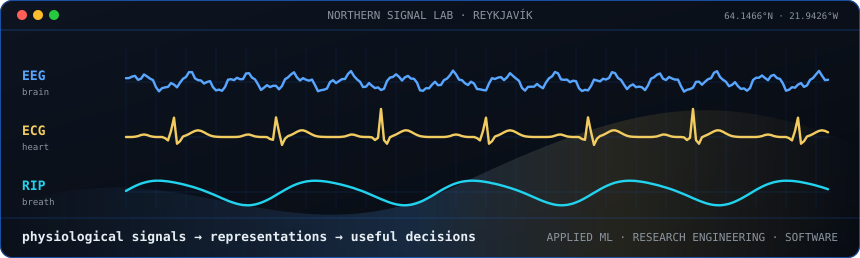

<!--
  Northern Signal: midnight surfaces, ice blue, and aurora gold.
  Regenerate with:
    python scripts/make_ascii_svg.py
    python scripts/make_wordmark_svg.py
    python scripts/make_signal_lab_svg.py
-->

<table>
<tr>
<td valign="top"></td>
<td valign="top"></td>
</tr>
</table>

## Research engineer moving from Reykjavík to New York to continue my studies — open to internships.

I build machine-learning and software systems for physiological time series, research, and data-heavy products. I'm looking for New York internship opportunities in applied ML, data, research engineering, and software development.

 

 

## Selected work

<table>
<tr>
<td colspan="2">
FIRST-AUTHOR RESEARCH · CURRENT PULMONOLOGY REPORTS · 2026  
<a href="https://doi.org/10.1007/s13665-026-00410-w"><strong>Toward Physiology-based Sleep Assessment: the Emerging Clinical Role of Advanced RIP Technology</strong></a> 
An open-access review of respiratory inductance plethysmography, from measurement and calibration to physiology-based assessment of sleep-disordered breathing.
</td>
</tr>
<tr>
<td width="50%" valign="top">
BUILDING FOR ICELAND  
<a href="https://golfkortari.snorribjarkason.com"><strong>Golfkortari</strong></a> 
An Icelandic golf-course map and personal tracker with accounts, course progress, ratings, notes, and wishlists.  
<a href="https://github.com/snorribja/golfkortari"><code>source →</code></a>
</td>
<td width="50%" valign="top">
DATA, MADE TANGIBLE  
<a href="https://statzooka.snorribjarkason.com"><strong>Statzooka</strong></a> 
A browser-first CSV workbench that turns arbitrary datasets into explorable 3D scatter plots without uploading the data.  
<a href="https://github.com/snorribja/statzooka"><code>source →</code></a>
</td>
</tr>
</table>

 

 

`Python` · `physiological signals` · `machine learning` · `statistics` · `distributed systems` · `TypeScript`

  

[**portfolio**](https://www.snorribjarkason.com) &nbsp;·&nbsp; [**research**](https://doi.org/10.1007/s13665-026-00410-w) &nbsp;·&nbsp; [**linkedin**](https://www.linkedin.com/in/snorribjarkason) &nbsp;·&nbsp; [**email**](mailto:snorribjarka@gmail.com)

 

REYKJAVÍK → NEW YORK · OPEN TO INTERNSHIPS

